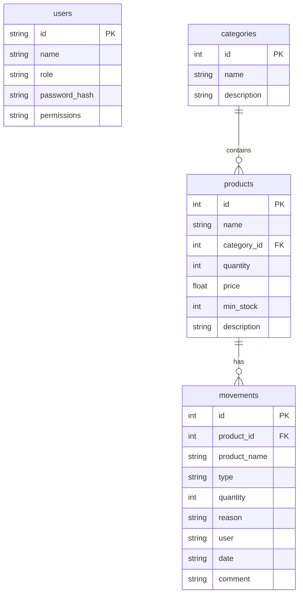
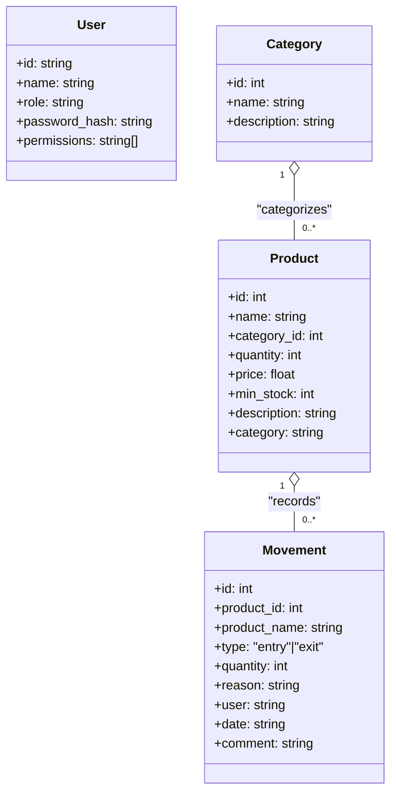

# Inventory Management System

A full-stack inventory management application with a Flask backend and responsive HTML frontend.

## How to run
To run the Inventory Management System locally:

1. **Download the project files**  
   - Download or copy all files from this repository to a folder on your computer.

2. **Install Python dependencies**  
   Open a terminal in the project folder and run:
   ```bash
   pip install -r requirements.txt
   ```

3. **Start the Flask backend**  
   In the same terminal, run:
   ```bash
   python app.py
   ```
   The backend will start on [http://127.0.0.1:5000](http://127.0.0.1:5000) by default.

4. **Open the frontend**  
   - Open the `repo_inventory.html` file in your web browser.
   - For best results, you can also serve the file using a local web server (e.g., `python -m http.server`) and visit [http://localhost:8000/repo_inventory.html](http://localhost:8000/repo_inventory.html).

5. **Login** using one of the default users listed below.

**Note:** No database setup is required; all data is stored in local JSON files by default.


## Features

- **Product Management**: Add, edit, delete products with categories
- **Stock Movements**: Track entries and exits with reasons and comments
- **Dashboard**: Real-time statistics and alerts
- **User Authentication**: Secure login with hashed passwords
- **Role-based Access**: Admin and Employee permissions
- **Responsive Design**: Works on desktop, tablet, and mobile
- **Session Persistence**: Remembers user login and last viewed page

## Security Features

- **Password Hashing**: All passwords are hashed using SHA-256
- **Backend Authentication**: No hardcoded passwords in frontend
- **Session Management**: Secure client-side session storage
- **API-based**: All data operations go through secure API endpoints

## Default Users

The system comes with pre-configured users:

| User ID | Name | Role | Password | Permissions |
|---------|------|------|----------|-------------|
| admin | Admin | Administrateur | 1234 | All features |
| employee1 | Marie | Employée | 0000 | Quick entry/exit only |
| employee2 | Pierre | Employé | 0000 | Quick entry/exit only |

## Setup

1. **Install Python dependencies**:
   ```bash
   pip install -r requirements.txt
   ```

2. **Start the Flask backend**:
   ```bash
   python app.py
   ```

3. **Open the frontend**:
   - Open `repo_inventory.html` in your web browser
   - Or serve it using a local web server

## API Endpoints

### Authentication
- `POST /api/auth/login` - User login
- `GET /api/auth/users` - Get all users

### Products
- `GET /api/products` - Get all products
- `POST /api/products` - Create new product
- `PUT /api/products/<id>` - Update product
- `DELETE /api/products/<id>` - Delete product

### Categories
- `GET /api/categories` - Get all categories
- `POST /api/categories` - Create new category

### Movements
- `GET /api/movements` - Get all movements
- `POST /api/movements` - Create new movement

### Dashboard
- `GET /api/dashboard` - Get dashboard statistics

## Database Schema

### Users Table
```sql
CREATE TABLE users (
    id TEXT PRIMARY KEY,
    name TEXT NOT NULL,
    role TEXT NOT NULL,
    password_hash TEXT NOT NULL,
    permissions TEXT NOT NULL
);
```

### Products Table
```sql
CREATE TABLE products (
    id INTEGER PRIMARY KEY AUTOINCREMENT,
    name TEXT NOT NULL,
    category_id INTEGER,
    quantity INTEGER DEFAULT 0,
    price REAL DEFAULT 0,
    min_stock INTEGER DEFAULT 0,
    description TEXT,
    FOREIGN KEY (category_id) REFERENCES categories (id)
);
```

### Categories Table
```sql
CREATE TABLE categories (
    id INTEGER PRIMARY KEY AUTOINCREMENT,
    name TEXT NOT NULL,
    description TEXT
);
```

### Movements Table
```sql
CREATE TABLE movements (
    id INTEGER PRIMARY KEY AUTOINCREMENT,
    product_id INTEGER,
    product_name TEXT,
    type TEXT NOT NULL,
    quantity INTEGER NOT NULL,
    reason TEXT,
    user TEXT,
    date TEXT,
    comment TEXT,
    FOREIGN KEY (product_id) REFERENCES products (id)
);
```

## Security Notes

- Passwords are hashed using SHA-256 before storage
- No passwords are stored in plain text
- Authentication is handled entirely on the backend
- Session data is stored in browser localStorage (consider using secure cookies for production)
- All API endpoints validate user permissions

## Usage

1. **Login**: Select your user and enter your password
2. **Dashboard**: View inventory statistics and recent activities
3. **Quick Entry/Exit**: Add or remove stock items quickly
4. **Products**: Manage product catalog (Admin only)
5. **Reports**: View movement history and analytics

## Responsive Design

The application is fully responsive and works on:
- Desktop computers
- Tablets
- Mobile phones

The interface automatically adapts to screen size with appropriate navigation and layout changes.

## Data Model Schema

### Entities and Relationships

- **User** (`users`)
  - `id` TEXT PRIMARY KEY
  - `name` TEXT NOT NULL
  - `role` TEXT NOT NULL
  - `password_hash` TEXT NOT NULL
  - `permissions` TEXT NOT NULL (comma-separated list; returned by API as string array)

- **Category** (`categories`)
  - `id` INTEGER PRIMARY KEY AUTOINCREMENT
  - `name` TEXT NOT NULL
  - `description` TEXT

- **Product** (`products`)
  - `id` INTEGER PRIMARY KEY AUTOINCREMENT
  - `name` TEXT NOT NULL
  - `category_id` INTEGER NULL REFERENCES `categories`(`id`)
  - `quantity` INTEGER DEFAULT 0
  - `price` REAL DEFAULT 0
  - `min_stock` INTEGER DEFAULT 0
  - `description` TEXT
  - API responses also include `category` (category name, derived via JOIN)

- **Movement** (`movements`)
  - `id` INTEGER PRIMARY KEY AUTOINCREMENT
  - `product_id` INTEGER REFERENCES `products`(`id`)
  - `product_name` TEXT (denormalized for history)
  - `type` TEXT NOT NULL ('entry' | 'exit')
  - `quantity` INTEGER NOT NULL
  - `reason` TEXT
  - `user` TEXT (free-text user name, not a foreign key)
  - `date` TEXT (ISO-8601 string)
  - `comment` TEXT

Relationships:
- A `product` belongs to a `category` (optional).
- A `movement` belongs to a `product`.

### API Data Contracts

#### Authentication
- POST `/api/auth/login`
  - Request:
    ```json
    { "userId": "string", "password": "string" }
    ```
  - Response 200:
    ```json
    { "id": "string", "name": "string", "role": "string", "permissions": ["string"] }
    ```

- GET `/api/auth/users`
  - Response:
    ```json
    [ { "id": "string", "name": "string", "role": "string" } ]
    ```

#### Categories
- GET `/api/categories`
  - Response:
    ```json
    [ { "id": 1, "name": "string", "description": "string" } ]
    ```

- POST `/api/categories`
  - Request:
    ```json
    { "name": "string", "description": "string (optional)" }
    ```
  - Response 201:
    ```json
    { "id": 1, "name": "string", "description": "string" }
    ```

#### Products
- GET `/api/products`
  - Response (each item):
    ```json
    {
      "id": 1,
      "name": "string",
      "category_id": 1,
      "quantity": 0,
      "price": 0,
      "min_stock": 0,
      "description": "string",
      "category": "Category Name" // derived
    }
    ```

- POST `/api/products`
  - Request:
    ```json
    {
      "name": "string",
      "categoryId": 1,
      "quantity": 0,
      "price": 0,
      "minStock": 0,
      "description": "string (optional)"
    }
    ```
  - Response 201: product object as in GET

- PUT `/api/products/<id>`
  - Request: same shape as POST
  - Response: product object as in GET

- DELETE `/api/products/<id>`
  - Response:
    ```json
    { "message": "Product deleted successfully" }
    ```

#### Movements
- GET `/api/movements`
  - Response (each item):
    ```json
    {
      "id": 1,
      "product_id": 1,
      "product_name": "string",
      "type": "entry" | "exit",
      "quantity": 0,
      "reason": "string",
      "user": "string",
      "date": "2024-01-01T12:00:00.000Z",
      "comment": "string"
    }
    ```

- POST `/api/movements`
  - Request:
    ```json
    {
      "productId": 1,
      "productName": "string",
      "type": "entry" | "exit",
      "quantity": 0,
      "reason": "string",
      "user": "string",
      "date": "2024-01-01T12:00:00.000Z",
      "comment": "string (optional)"
    }
    ```
  - Response 201: movement object as in GET

#### Dashboard
- GET `/api/dashboard`
  - Response:
    ```json
    {
      "total_products": 0,
      "low_stock": 0,
      "out_stock": 0,
      "total_value": 0,
      "recent_movements": [ /* array of movement objects */ ]
    }
    ```

## Diagrams

### ER (Merise-style) Diagram



### UML Class Diagram



